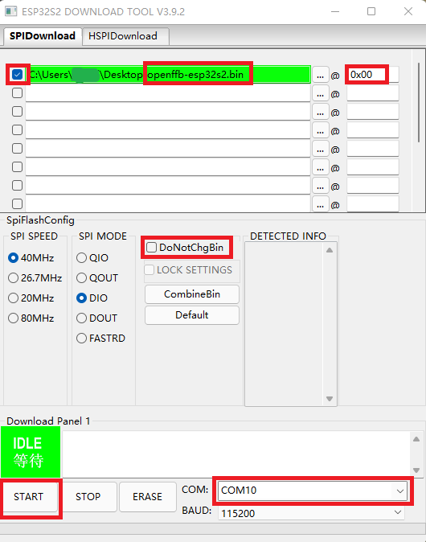

# OpenFFBoard-ESP32S2

[OpenffBoard](https://github.com/Ultrawipf/OpenFFBoard) 是一个开源的力反馈方向盘的项目。原项目是 STM32F4 做主控，这里的 OpenFFBoard-ESP32S2 将主控换成了乐鑫的 ESP32-S2/S3 芯片，成本将得到极大的降低，同时提供了 WiFi 的连接能力（虽然现在并没有用上），在使用 VESC 做电机驱动时已经可以和 STM32 主控板效果一样好。

> V1.1 版本的硬件支持 ESP32-S2 和 ESP32-S3 二选一焊接，下文统筹为 ESP32

## 功能

和原项目相比，ESP32 不能提供足够多的 GPIO ，所以按键输入和模拟输入通道数均从原来的 8 通道精简到了 4 通道。详细信息见原理图 [esp32s2-openffb.pdf](openffboard-esp32s2/esp32s2-openffb.pdf)。
ESP32 的源码已提交 Pull Request 到原项目，支持的功能以及进度见 [PR](https://github.com/Ultrawipf/OpenFFBoard/pull/46)。

## 文件结构

```
├── LICENSE                <- 开源协议 >
├── my-vesc-board          <- VESC 板 >
├── openffboard-esp32s2    <- OpenFFBoard 主控板 >
└── README.md              <- 此文件 >
```

## 固件烧录

不想搭建编译环境可以直接烧录编译好的 [bin](https://github.com/TDA-2030/OpenFFBoard/tree/feature/add_esp32s2/Firmware/Targets/ESP32SX/firmware) 文件 

### 烧录方法

1. 先把 IO0 接到 GND，再连接USB到电脑，
2. 下载烧录软件[flash_download_tool](https://www.espressif.com/sites/default/files/tools/flash_download_tool_3.9.2.zip)
3. 运行软件

    

    

## Preview image


## 电机驱动板

为了造福广大劳动人民，针对原项目的电机驱动我也进行了低成本的改造，原项目是采用了比较贵的 TMC4761 专用 FOC 控制芯片，我将著名的开源电调 [VESC](https://vesc-project.com/) 进行了魔改，去掉了昂贵的 DRV8301 芯片，用多个芯片实现了这一个芯片的功能。集成度下降了，但是价格更友好。魔改后的 VESC 我叫它 `Simple-BLDC` 。关于电机驱动板的更多信息见 [Simple-BLDC](my-vesc-board/README.md)
