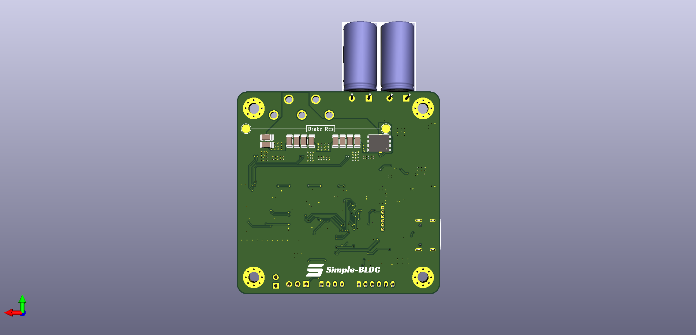
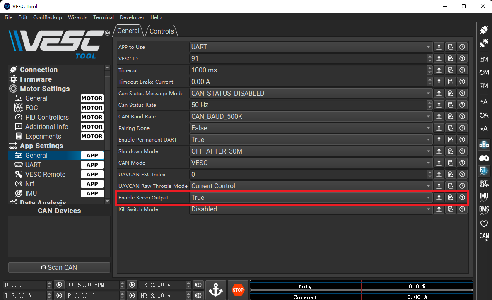

# Simple-BLDC

```
 _____ _                 _       ______ _    ______  _____ 
/  ___(_)               | |      | ___ \ |   |  _  \/  __ \
\ `--. _ _ __ ___  _ __ | | ___  | |_/ / |   | | | || /  \/
 `--. \ | '_ ` _ \| '_ \| |/ _ \ | ___ \ |   | | | || |    
/\__/ / | | | | | | |_) | |  __/ | |_/ / |___| |/ / | \__/\
\____/|_|_| |_| |_| .__/|_|\___| \____/\_____/___/   \____/
                  | |                                      
                  |_|                                      
```

Simple-BLDC 是基于 VESC6 的一个低成本实现方案，在硬件上兼容 VESC6 的固件

## 特点

- 超低成本
- 60mm x 60mm 双面板
- 元件单面布局
- 新增制动电阻功能
- USB Type-C 接口

## 参数

1. 输入电压：12V - 36V
2. 电机电流：50A
3. 编码器支持：AS5047（SPI接口）、ABI编码器
4. 通信接口：CAN总线接口、UART

## 固件源码

板子兼容[原版固件](https://github.com/vedderb/bldc)，专门适配的固件新增了制动电阻功能，你可以在 [bldc](https://github.com/TDA-2030/bldc/tree/hw_simple_bldc) 中看到对应的源代码。如何编译固件请参考[这里](https://github.com/TDA-2030/bldc/tree/hw_simple_bldc#prerequisites)，目前只提供在 linux 和 MacOS 编译的说明，Windows 编译会麻烦一些需要自行想办法。

## 上位机工具 VESC-TOOL

固件对应的 VESC-TOOL 版本为 `3.01`，在此[下载](./vesc_tool_3.01.exe)

## 制动电阻功能

原版的 VESC 是为电池设备设计的，所以是再生制动的方式，为了适应常见的开关电源，我加上了制动电阻来消耗再生制动的能量，防止开关电源超压损坏。
该功能需要在板子背面焊接上一个功率电阻，如下图：



电阻阻值一般为 1Ω 或 2Ω。

> 注意：制动电阻功能是在有点笨的保持电压在电机空闲时的输入电压，所以当电机在运行，并且你的输入电压在升高，那么制动电阻将会从电源消耗电流，电流值与变化的电压差值成正比。

制动电阻功能可以在 VESC-TOOL 进行开关选择，如下图：


