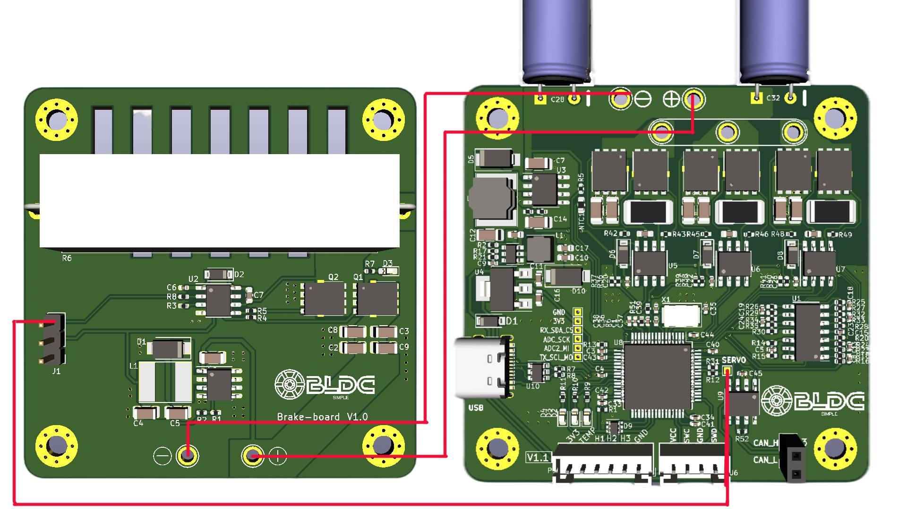
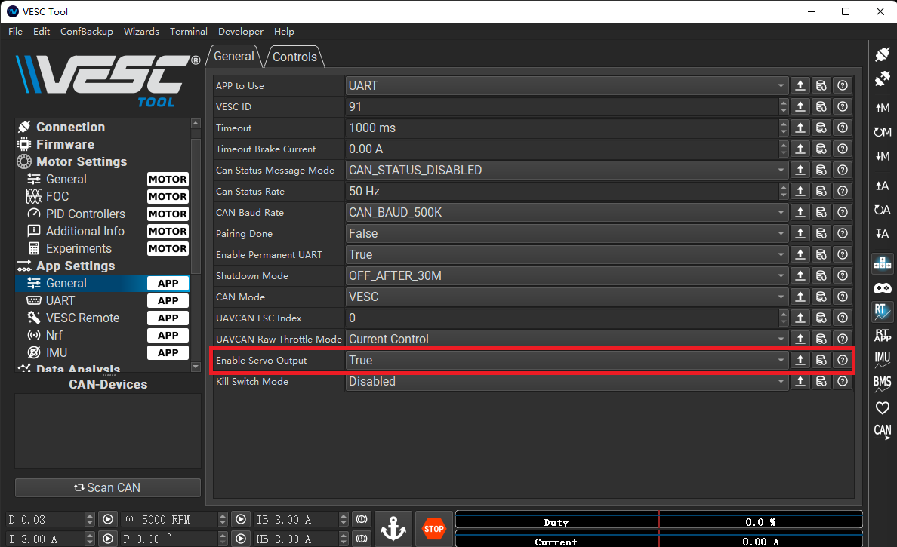

# Simple-BLDC

Simple-BLDC 是基于 VESC6 的一个低成本实现方案，在硬件上兼容 VESC6 的固件

## 特点

- 超低成本
- 60mm x 60mm 双面板
- 元件单面布局
- 新增制动电阻功能
- USB Type-C 接口

## 参数

1. 输入电压：12V - 32V （短板芯片最高支持 40V，保守一点）
2. 电机电流：50A （MOS 管是 80A 的）
3. 编码器支持：AS5047（SPI接口）、ABI编码器
4. 通信接口：CAN总线接口、UART

## 固件源码

板子兼容[原版固件](https://github.com/vedderb/bldc)，但是为配合 OpenFFboard 使用，需要最新的开发分支，由于还未release，这里先提供编译好的 bin 文件供烧录 [BLDC_4_ChibiOS.bin](BLDC_4_ChibiOS.bin)，

## 上位机工具 VESC-TOOL

固件对应的 VESC-TOOL 版本为 `3.01`，在此[下载](https://github.com/manoukianv/vescFirmware4OpenFFBoard/releases/download/dev_fw_5_0_3_b51/vesc_tools_3.0.1_51b.zip)

## 制动电阻功能

原版的 VESC 是为电池设备设计的，所以是再生制动的方式，为了适应常见的开关电源，我加上了制动电阻来消耗再生制动的能量，防止开关电源超压损坏。
此功能需要额外的一个 [brake-board](./brake-board) 板子，其上有套控制电阻电流的电路用来准确消耗再生制动的能量。

制动电阻板是后面的突发奇想，所以需要飞线来连接，下面是连接图：

> 注意：制动电阻功能是在有点笨的保持电压在电机空闲时的输入电压，所以当电机在运行，并且你的输入电压在升高，那么制动电阻将会从电源消耗电流，电流值与变化的电压差值成正比。

制动电阻功能可以在 VESC-TOOL 进行开关选择，如下图：

